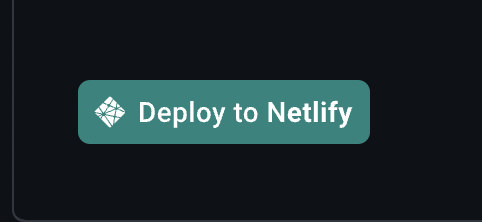
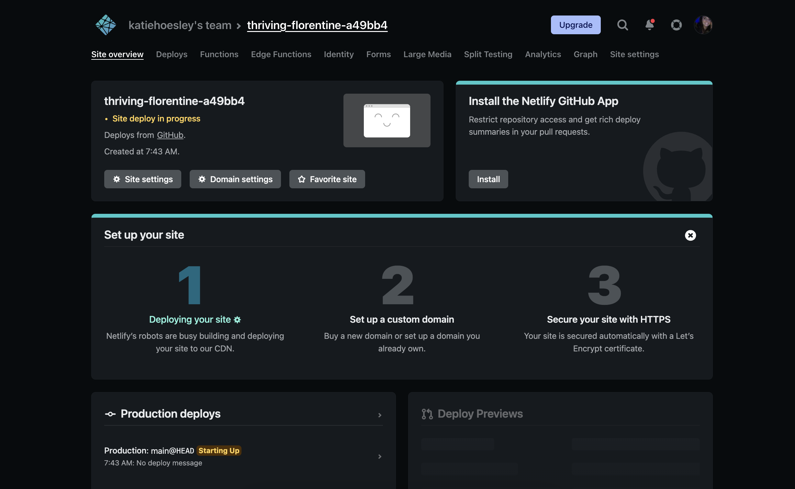

# ReadMe

These instructions will guide you through the process of deploying an app onto Vercel using BigCommerce, NextJS & ContentStack.

Technologies included in this demo: 
- [BigCommerce](https://www.bigcommerce.com/)
- [Next.js](https://nextjs.org/docs)
- [Vercel](https://vercel.com/dashboard)
- [ContentStack](https://www.contentstack.com/)

These are the first steps you need to complete to be able to follow instructions given during our presentation. 

[Have your own starter?](https://forms.gle/e48caonHNiZBEqDR8) 
[Don't see what you're looking for? Request an option!](https://forms.gle/PYnMDa7SKTRaXzzc6) 

## Let's Get Started! 
 

1. Step One: ✅ You're here! The first step is being in this repo and hitting the "Deploy to Netlify" button at the bottom of this ReadME.  

1. You need a BigCommerce store! Login or Sign Up to set up a new BigCommerce store to use! Once you've logged in or signed up, follow [these instrucitons](https://support.bigcommerce.com/s/article/Store-API-Accounts?language=en_US#creating) to obtain your BigCommerce API credentials.  

1. Next, create an account or login to [ContentStack](https://app.contentstack.com/?_gl=1*2rimkv*_gcl_aw*R0NMLjE2NjU3MDM5NDMuQ2p3S0NBanc3cDZhQmhCaUVpd0E4M2ZHdXNVa1RHRTdOWjZaQ0RoVWJEbjVNMm1odTAwQzRiOW52SDRoZEp2eHJnTGdXYlFLQllLOE1Cb0NPdzBRQXZEX0J3RQ..#!/login). 

1. Create a "Stack" by selecting "+ New Stack", title it, add a description, and click "Create".  

1. Now that your Stack has been created, let's identify your API keys. Navigate to 
    the "Settings" icon on your lefthand panel.  
     
    Now, scroll down and select "Tokens". 

    

    This will take you to a page that has a "+ Delivery Tokens" button. Click that, and enter a name and description for your new API keys. 

    

    

    Select the proper branch you're working from and your production environment (you may need to also create a production environment). Then click "Generate Token". 

    If successful, you should see something like this: 
    

1. Hang on to these variables, you'll need them in an upcoming step.  
 

1. Now, back to this ReadME file you're in right now! Hit the "Deploy to Netlify" button found at the bottom of the page. 

 

1. Once you're brought to the page pictured below, select "Connect to Github" 

 

1. Once you're brought to this page (seen in screenshots below), give your repository a unique name and enter all of your BigCommerce and ContentStack API credentials.  

 

1. Save and Deploy!  

 

1. The deploy process begins! This may take up to 10 minutes, and will bring you to a page that looks like this: 

 

1. You can watch your project's progress by clicking on the tab pictured below: 

 

1. If you click into that tab, once your build is successfully complete, you'll see something like this: 

 

1. To view your site, click "Open Production Deploy" or "Permalink" - both will bring you to your deployed site! 

 

1. You're deployed! Great job! 👏 
 

------ 
 

