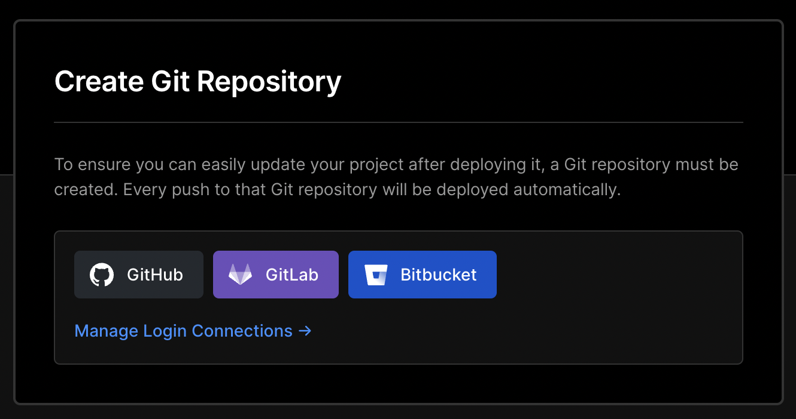
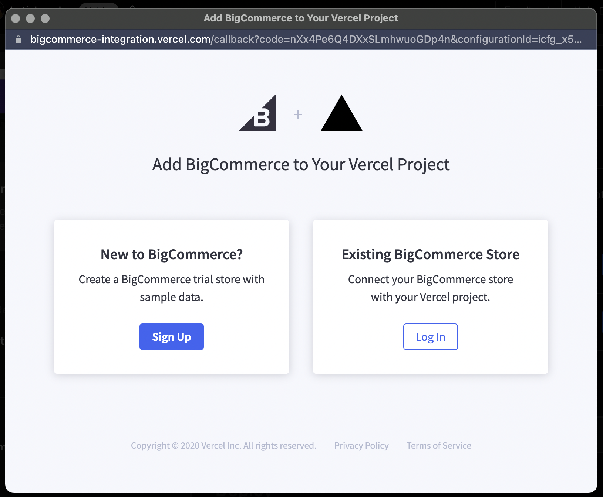
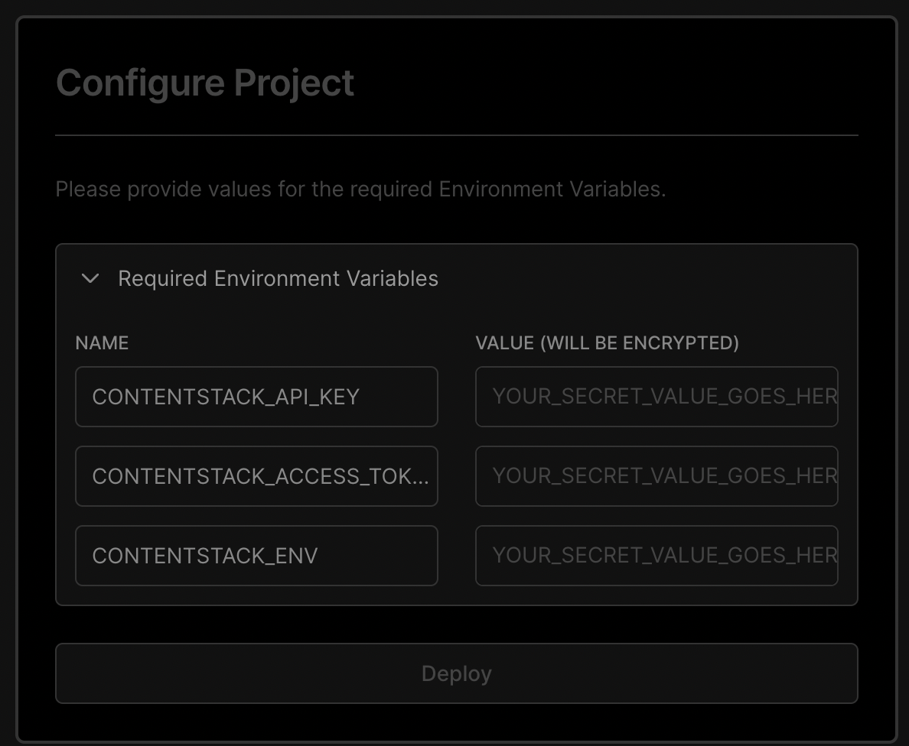

# ReadMe

These instructions will guide you through the process of deploying an app onto Vercel using BigCommerce, NextJS & ContentStack.

Technologies included in this demo: 
- [BigCommerce](https://www.bigcommerce.com/)
- [Next.js](https://nextjs.org/docs)
- [Vercel](https://vercel.com/dashboard)
- [ContentStack](https://www.contentstack.com/)

These are the first steps you need to complete to be able to follow instructions given during our presentation. 

[Have your own starter?](https://forms.gle/e48caonHNiZBEqDR8) 
[Don't see what you're looking for? Request an option!](https://forms.gle/PYnMDa7SKTRaXzzc6) 

## Let's Get Started! 
 

1. Step One: ✅ You're here! The first step is being in this repo and hitting the "Deploy" button at the bottom of this ReadME.  

1. Hit the "Deploy" button. 

 

1. Login to your Vercel Account. If you don't have a Vercel account, make one now! 

1. Hit "GitHub", or whichever platform you are going to use, under "Create Git Repo..."  

 

1. Enter a name for this repository (it's going to clone itself into your repository platform account)  

 

1. Repository being created..  

1. Login or Sign Up to set up a new BigCommerce store to use!  

 

1. The deploy process begins! This may take up to 10 minutes. 

1. Create an account or login to [ContentStack](https://app.contentstack.com/?_gl=1*2rimkv*_gcl_aw*R0NMLjE2NjU3MDM5NDMuQ2p3S0NBanc3cDZhQmhCaUVpd0E4M2ZHdXNVa1RHRTdOWjZaQ0RoVWJEbjVNMm1odTAwQzRiOW52SDRoZEp2eHJnTGdXYlFLQllLOE1Cb0NPdzBRQXZEX0J3RQ..#!/login). 

1. Create a Stack by selecting "+ New Stack", title it, add a description, and click "Create".  

1. Now that your Stack has been created, let's identify your API keys. Navigate to 
    the "Settings" icon on your lefthand panel.  
     
    Now, scroll down and select "Tokens". 

    

    This will take you to a page that has a "+ Delivery Tokens" button. Click that, and enter a name and description for your new API keys. 

    

    

    Select the proper branch you're working from and your production environment (you may need to also create a production environment). Then click "Generate Token". 

    If successful, you should see something like this: 
    

1. Add your ContentStack API keys under the "Configure Project" once the fields become available after initial deployment.  

 

1. Hit the "Deploy" button under "Configure Project" once your keys are entered.

1. You're deployed! Great job! 👏 

------ 
 

